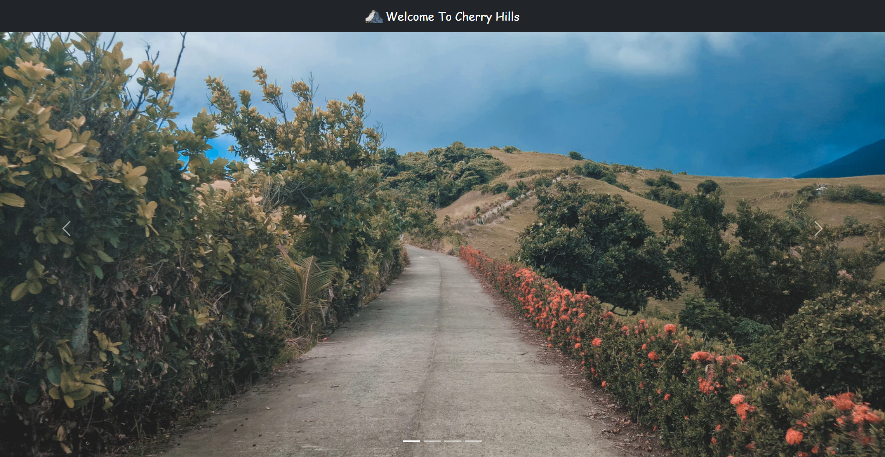
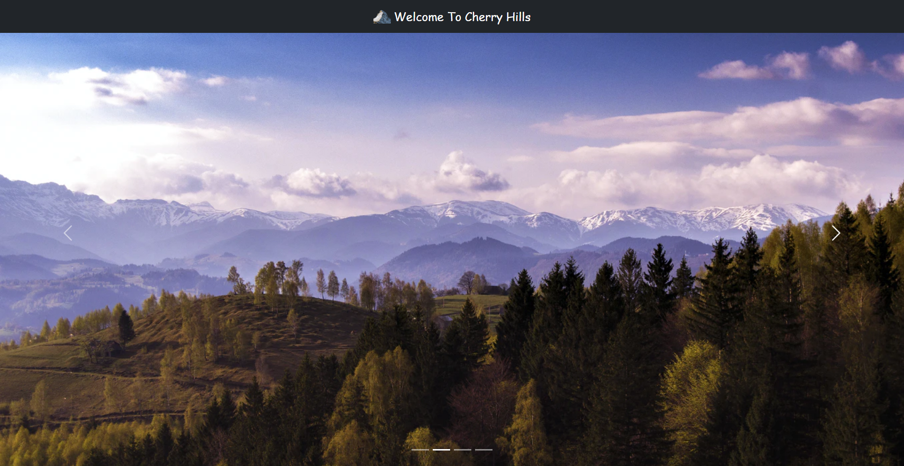

# Cherry Hills

This is a simple webpage with a navbar and a carousel which was used to demonstrate how to host a website using GitHub pages.

## Link to Video

- [Watch on YouTube](https://youtu.be/ylEYgfhZ71c)

## Link to Hosted Page

- [Visit page](https://cobytab.github.io/cherry-hills/)

## Tools Used

- HTML
- CSS
- [Bootstrap](https://getbootstrap.com)

## Screenshots

## Acknowledgement

- [Unsplash](https://unsplash.com) - Source for images used
